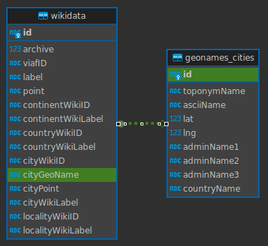

# Workflow to Aggregate Archives

## 0. Set up
- Install MySQL and create a user with a password.
- Test the log-in and create a database 'archives'.
- Save the username and password as environment variables.

```shell
$ export MYSQL_USER=username
$ export MYSQL_PASS=password
```

- Git clone this environment.
- Create a virtual Python environment (version 3.12) and install the requirements.
- Test the Python code's ability to connect to the MySQL server with the script [`test_database.py`](test_database.py).
```shell
$ python test_database.py
```

## 1. Collect dataset of archives from WikiData

- Be sure the MySQL server is running.
- Be sure to have saved the log-in credentials for a user that has access to the 'archives' database on the MySQL server.
```shell
$ export MYSQL_USER=username
$ export MYSQL_PASS=password
```
- Run the python script [`wikidata.py`](wikidata.py), which sends the SPARQL query in [`wikidata-archives.txt`](wikidata-archives.txt) to WikiData and saves the result in the MySQL table 'wikidata'.
```shell
$ python wikidata.py
```
- Check the results in your MySQL database.
```shell
mysql> show tables;
+--------------------+
| Tables_in_archives |
+--------------------+
| geonames_cities    |
| pytest             |
| wikidata           |
+--------------------+
3 rows in set (0,00 sec)

mysql> select count(*) from wikidata;
+----------+
| count(*) |
+----------+
|     1686 |
+----------+
1 row in set (0,01 sec)

```



## 2. Enrich archives' cities with GeoNames

- Create a free account with [GeoNames](https://www.geonames.org/login) in order to use the API.
- Save your account's username in the environment variable `GEONAMES`.
```shell
$ export GEONAMES=username
```
- Be sure to have saved the log-in credentials for a user that has access to the 'archives' database on the MySQL server.
```shell
$ export MYSQL_USER=username
$ export MYSQL_PASS=password
```
- Run the python script that [`geonames.py`], which creates the table 'geonames_cities' and populates it with cities in which WikiData says the institutions in the 'archives' table are located.
```shell
$ python geonames.py
```
- Check the results in your MySQL database.
```shell
mysql> select * from geonames_cities limit 1;
+----------+-------------+-----------+----------+----------+--------------+------------+------------------+-------------+
| id       | toponymName | asciiName | lat      | lng      | adminName1   | adminName2 | adminName3       | countryName |
+----------+-------------+-----------+----------+----------+--------------+------------+------------------+-------------+
| 10942643 | Goslar      | Goslar    | 51.90641 | 10.42897 | Lower Saxony |            | Landkreis Goslar | Germany     |
+----------+-------------+-----------+----------+----------+--------------+------------+------------------+-------------+
1 row in set (0,00 sec)

```